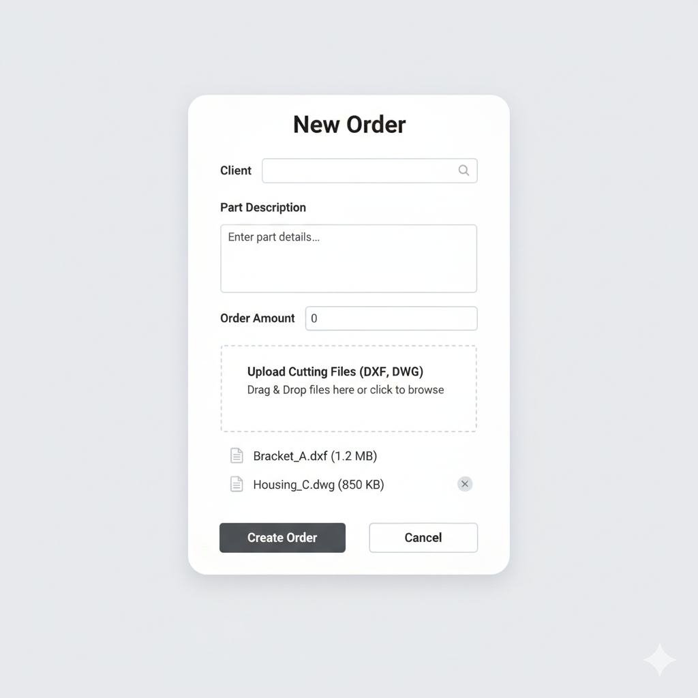
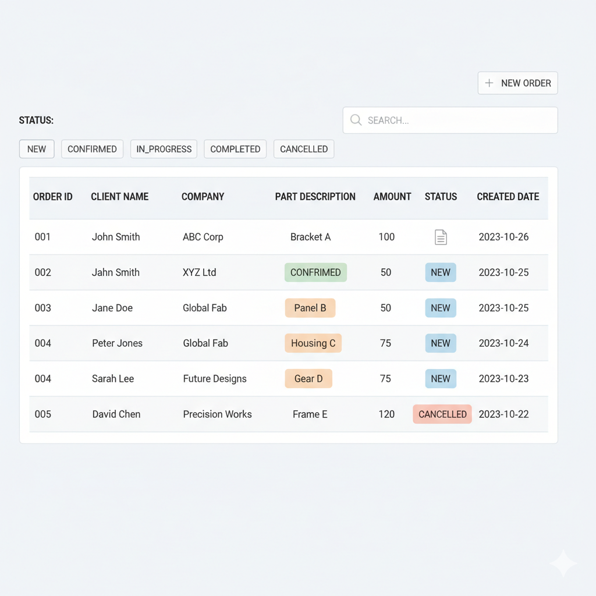
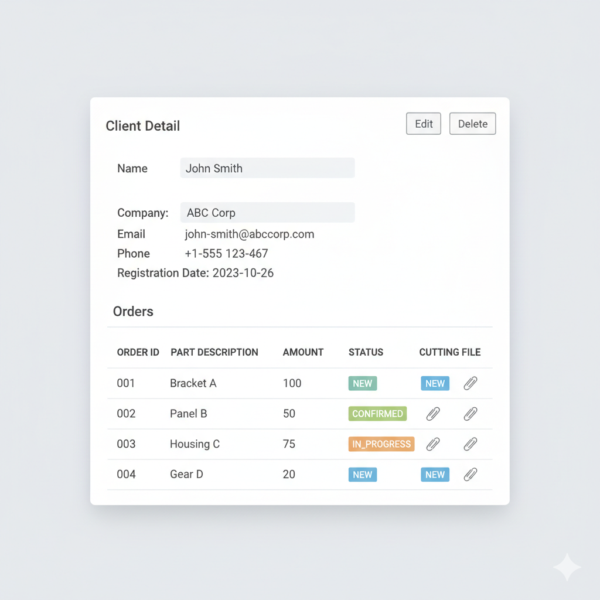
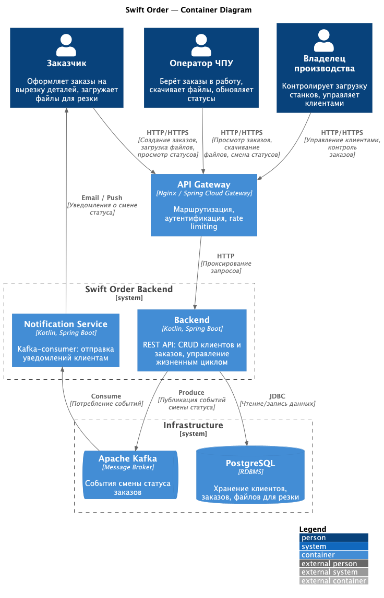

# Swift Order

Бэкенд-сервис для заказа вырезки деталей на ЧПУ станках. Компания владеет парком ЧПУ станков, клиенты оформляют заказы на изготовление деталей через API. Сервис управляет жизненным циклом заказов и уведомляет клиентов о смене статусов через Kafka.

## Целевая аудитория

Производственные компании с парком ЧПУ станков, принимающие заказы на вырезку деталей от внешних клиентов.

### Портреты клиентов

**Владелец производства (Админ)**
- Контролирует загрузку станков и поток заказов
- Управляет клиентской базой
- Отслеживает статусы всех заказов

**Оператор ЧПУ**
- Берёт заказ в работу, скачивает файл для резки
- Меняет статусы заказов по мере выполнения
- Работает с системой ежедневно

**Заказчик (клиент компании)**
- Оформляет заказ на вырезку деталей, загружает файл для резки
- Получает уведомления о смене статуса
- Отслеживает состояние своего заказа

Подробное [описание аудитории и портретов клиентов](docs/01-biz/01-target-audience.md).


## MVP

Минимальный продукт включает:
- CRUD-операции для клиентов
- CRUD-операции для заказов с загрузкой файлов для резки
- Жизненный цикл заказа: NEW → CONFIRMED → IN_PROGRESS → COMPLETED / CANCELLED
- Отправка событий смены статуса в Kafka
- Уведомление клиентов через Kafka-consumer

### Эскиз фронтенд-представления

Основные экраны:
1. **Список клиентов** — таблица с поиском и кнопкой «Добавить клиента»
2. **Карточка клиента** — данные клиента и компании + список его заказов
3. **Список заказов** — таблица с фильтрацией по статусу
4. **Карточка заказа** — данные заказа, прикреплённый файл, текущий статус, кнопки смены статуса





## Сущности

### Client

| Поле      | Тип      | Описание                 |
|-----------|----------|--------------------------|
| id        | UUID     | Уникальный идентификатор |
| name      | String   | Имя клиента              |
| company   | String   | Название компании        |
| email     | String   | Электронная почта        |
| phone     | String   | Номер телефона           |
| createdAt | DateTime | Дата создания            |

### Order

| Поле        | Тип         | Описание                                      |
|-------------|-------------|-----------------------------------------------|
| id          | UUID        | Уникальный идентификатор                      |
| clientId    | UUID        | Ссылка на клиента                             |
| description | String      | Описание детали/заказа                        |
| status      | OrderStatus | Текущий статус                                |
| amount      | BigDecimal  | Сумма заказа                                  |
| fileName    | String      | Имя загруженного файла (например, detail.dxf) |
| fileData    | byte[]      | Содержимое файла для резки                    |
| createdAt   | DateTime    | Дата создания                                 |
| updatedAt   | DateTime    | Дата последнего обновления                    |

### OrderStatus

```
NEW → CONFIRMED → IN_PROGRESS → COMPLETED
                               → CANCELLED
```

- **NEW** — заказ создан
- **CONFIRMED** — заказ подтверждён
- **IN_PROGRESS** — заказ выполняется
- **COMPLETED** — заказ завершён
- **CANCELLED** — заказ отменён

## Архитектура



Компоненты:
- **Заказчик / Оператор ЧПУ / Админ** — пользователи системы, взаимодействуют через HTTP/HTTPS
- **API Gateway** (Nginx / Spring Cloud Gateway) — единая точка входа: маршрутизация, аутентификация, rate limiting
- **Backend** (Kotlin, Spring Boot) — REST API: CRUD клиентов и заказов, управление жизненным циклом
- **Notification Service** (Kotlin, Spring Boot) — Kafka-consumer, отправляет уведомления клиентам
- **PostgreSQL** — хранение клиентов, заказов и файлов для резки
- **Apache Kafka** — брокер сообщений для событий смены статуса

Связи:
- Пользователи → API Gateway: HTTP/HTTPS-запросы
- API Gateway → Backend: проксирование запросов
- Backend → PostgreSQL: чтение/запись данных (JDBC)
- Backend → Kafka: публикация событий смены статуса
- Kafka → Notification Service: потребление событий
- Notification Service → Заказчик: уведомления (email/push)
