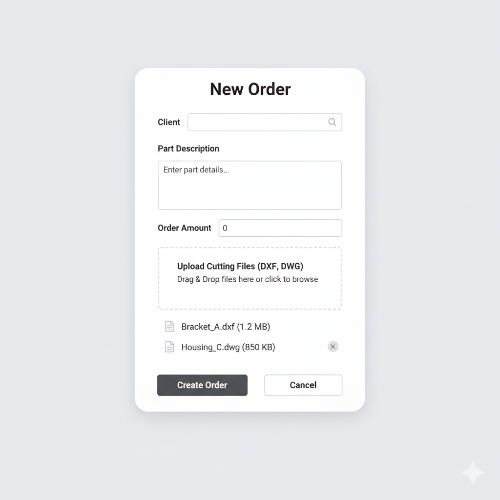
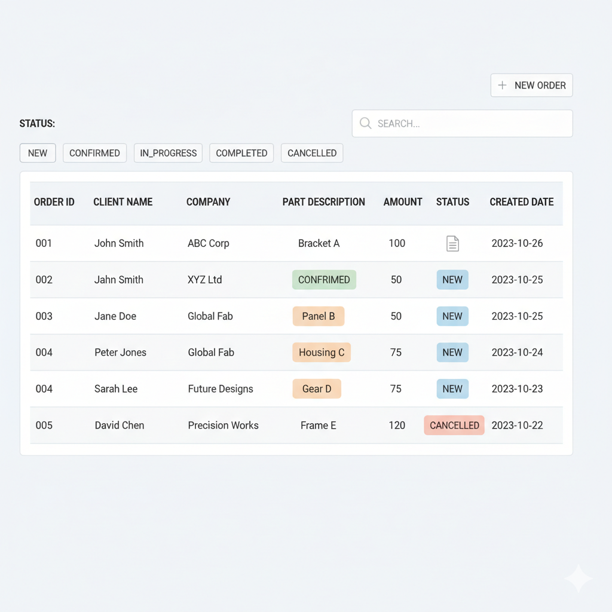
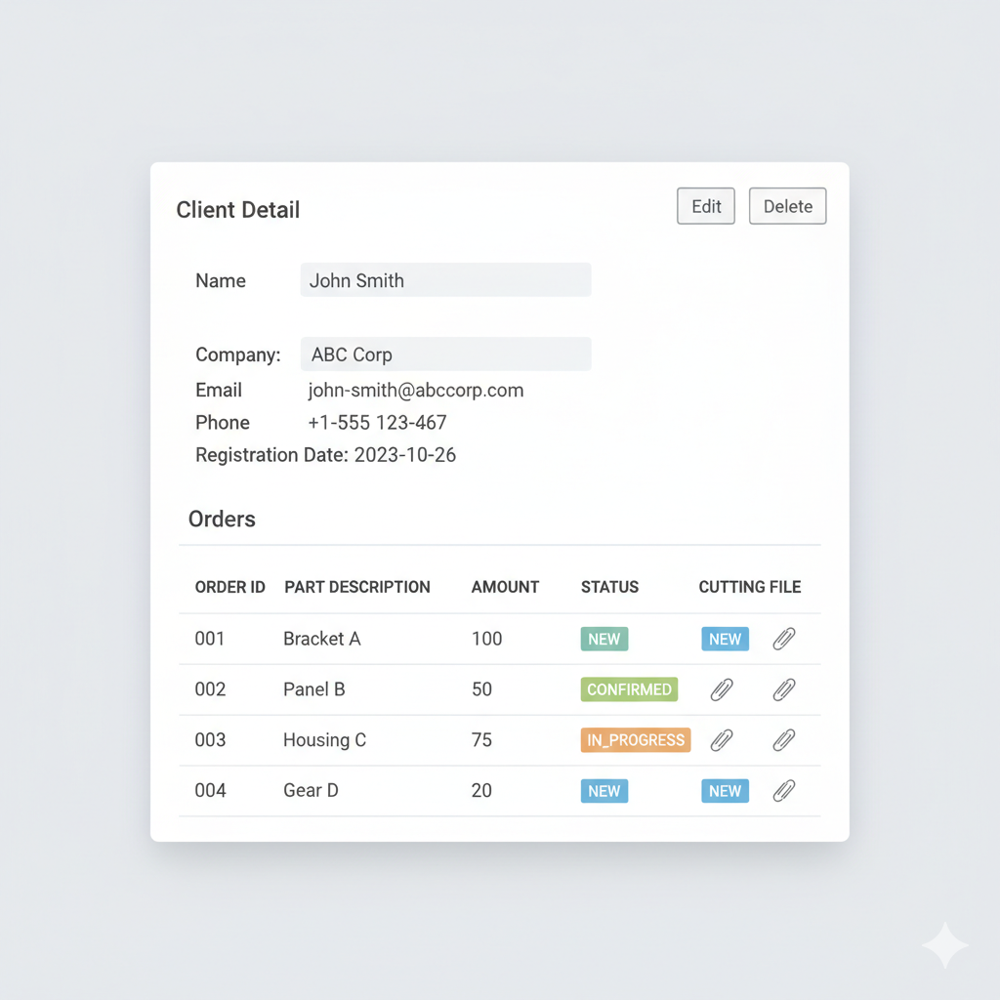
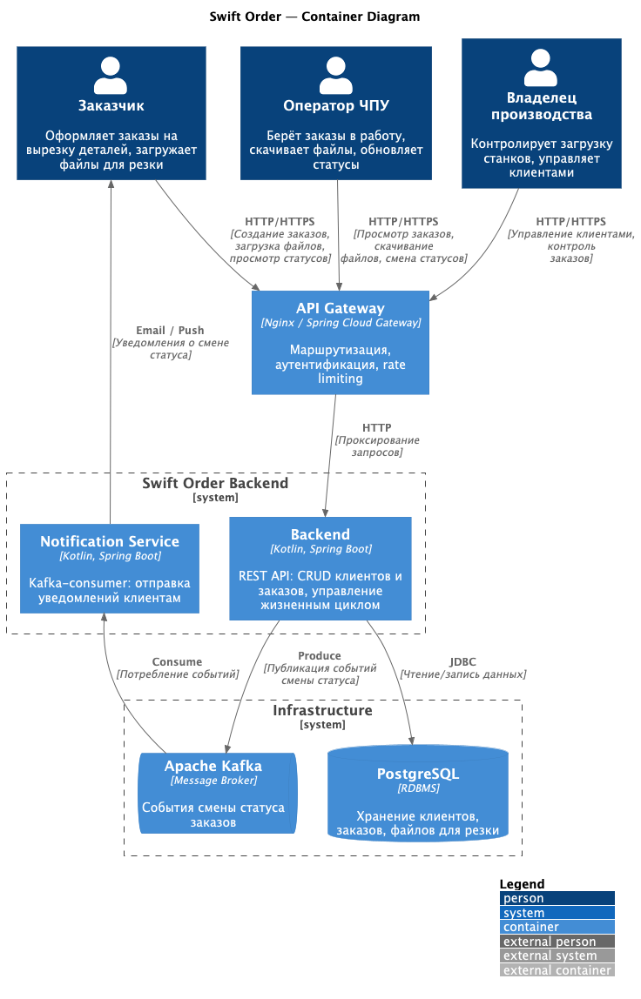

# Swift Order

Бэкенд-сервис для заказа вырезки деталей на ЧПУ станках. Компания владеет парком ЧПУ станков, клиенты оформляют заказы на изготовление деталей через API. Сервис управляет жизненным циклом заказов и уведомляет клиентов о смене статусов через Kafka.

## Целевая аудитория

Производственные компании с парком ЧПУ станков, принимающие заказы на вырезку деталей от внешних клиентов.

### Портреты клиентов

**Владелец производства (Админ)**
- Контролирует загрузку станков и поток заказов
- Управляет клиентской базой
- Отслеживает статусы всех заказов

**Оператор ЧПУ**
- Берёт заказ в работу, скачивает файл для резки
- Меняет статусы заказов по мере выполнения
- Работает с системой ежедневно

**Заказчик (клиент компании)**
- Оформляет заказ на вырезку деталей, загружает файл для резки
- Получает уведомления о смене статуса
- Отслеживает состояние своего заказа

Подробное [описание аудитории и портретов клиентов](docs/01-biz/01-target-audience.md).


## MVP

Минимальный продукт включает:
- CRUD-операции для клиентов
- CRUD-операции для заказов с загрузкой файлов для резки
- Жизненный цикл заказа: NEW → CONFIRMED → IN_PROGRESS → COMPLETED / CANCELLED
- Отправка событий смены статуса в Kafka
- Уведомление клиентов через Kafka-consumer

### Эскиз фронтенд-представления

Основные экраны:
1. **Список клиентов** — таблица с поиском и кнопкой «Добавить клиента»
2. **Карточка клиента** — данные клиента и компании + список его заказов
3. **Список заказов** — таблица с фильтрацией по статусу
4. **Карточка заказа** — данные заказа, прикреплённый файл, текущий статус, кнопки смены статуса





## Сущности

### SwiftOrder

Реальная модель из `models/.../SwiftOrder.kt`:

| Поле        | Тип               | Описание                                          |
|-------------|-------------------|---------------------------------------------------|
| id          | SwiftOrderId      | Уникальный идентификатор заказа                   |
| description | String            | Описание заказа                                   |
| amount      | BigDecimal        | Сумма заказа                                      |
| status      | SwiftOrderStatus  | Текущий статус                                    |
| ownerId     | SwiftOwnerId      | Идентификатор владельца (клиента)                 |
| fileId      | SwiftFileId       | Идентификатор файла для резки во внешнем хранилище |

`SwiftOrderId`, `SwiftOwnerId`, `SwiftFileId` — value-классы поверх строки (см. `SwiftId.kt`).

Отдельной сущности `Client` в MVP пока нет — клиент представлен только полем `ownerId` в заказе.

### SwiftOrderStatus

```
NEW → CONFIRMED → IN_PROGRESS → COMPLETED
                               → CANCELLED
```

- **NONE** — статус не задан
- **NEW** — заказ создан
- **CONFIRMED** — заказ подтверждён
- **IN_PROGRESS** — заказ выполняется
- **COMPLETED** — заказ завершён
- **CANCELLED** — заказ отменён

## Архитектура



Компоненты:
- **Заказчик / Оператор ЧПУ / Админ** — пользователи системы, взаимодействуют через HTTP/HTTPS
- **API Gateway** (Nginx / Spring Cloud Gateway) — единая точка входа: маршрутизация, аутентификация, rate limiting
- **Backend** (Kotlin, Spring Boot) — REST API: CRUD клиентов и заказов, управление жизненным циклом
- **Notification Service** (Kotlin, Spring Boot) — Kafka-consumer, отправляет уведомления клиентам
- **PostgreSQL** — хранение клиентов, заказов и файлов для резки
- **Apache Kafka** — брокер сообщений для событий смены статуса

Связи:
- Пользователи → API Gateway: HTTP/HTTPS-запросы
- API Gateway → Backend: проксирование запросов
- Backend → PostgreSQL: чтение/запись данных (JDBC)
- Backend → Kafka: публикация событий смены статуса
- Kafka → Notification Service: потребление событий
- Notification Service → Заказчик: уведомления (email/push)

## Запуск

### Поднять весь стек в Docker

Из корня репозитория `kotlin-backend-developer/`:

```bash
./gradlew :swift-order:app-spring:bootJar :swift-order:app-ui:installDist \
  && cd swift-order/docker \
  && docker-compose up --build
```

Команда делает три шага:
1. `:swift-order:app-spring:bootJar` — собирает исполняемый Spring Boot jar бэкенда (`app-spring/build/libs/swift-order-app.jar`).
2. `:swift-order:app-ui:installDist` — собирает дистрибутив Ktor-приложения UI (`app-ui/build/install/app-ui/`).
3. `docker-compose up --build` — пересобирает Docker-образы (используют артефакты из шагов 1–2) и поднимает Zookeeper, Kafka, Postgres, бэкенд (8080) и UI (8081).

После запуска UI доступен на <http://localhost:8081/orders>. Подробнее про порты и сервисы — [docker/README.md](docker/README.md).

### Тесты

```bash
cd swift-order
../gradlew check
```

`check` запускает все verification-таски (включая `test`) во всех модулях `swift-order`: `biz`, `app-spring`, `app-kafka`, `app-ui`, `mappers`, `repo-inmemory`, `repo-postgres` и т.д. Запускать из `swift-order/`, потому что это composite build — у корневого проекта своего `check` нет.

Postgres-тесты требуют живого Docker. Чтобы прогнать всё, кроме них:

```bash
../gradlew check -x :repo-postgres:test
```
